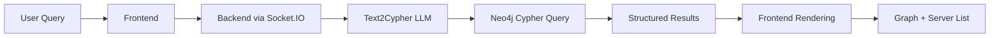

<!-- 
To generate PDF or HTML from this presentation:
npx @marp-team/marp-cli@latest PRESENTATION.md -o ~/Desktop/askg-presentation.pdf
npx @marp-team/marp-cli@latest PRESENTATION.md -o ~/Desktop/askg-presentation.html

For HTML with speaker notes:
npx @marp-team/marp-cli@latest PRESENTATION.md --html --allow-local-files -o ~/Desktop/askg-presentation.html
-->

# ASKG - AI Server Knowledge Graph
## MCP Server Discovery & Exploration Platform

**A powerful chat interface for discovering and exploring MCP (Model Context Protocol) servers with an interactive knowledge graph visualization.**

---

## 🎯 Project Overview

**ASKG** combines AI-powered query conversion with real-time search and comprehensive server information display.

### Core Capabilities
- 🤖 **AI-Powered Search**: Natural language to Cypher query conversion
- 🗣️ **Interactive Chat**: Persistent conversations with smart management
- 📊 **Knowledge Graph**: D3.js-powered interactive visualization
- 🔍 **Server Discovery**: Comprehensive MCP server exploration
- 📱 **Responsive Design**: Works on desktop and mobile devices

---

## 🚀 Key Features - AI-Powered Query Conversion

### LLM-Enhanced Search
- **GPT-4o-mini Integration**: Converts natural language to Cypher queries
- **Intelligent Fallback**: Robust fallback mechanism for complex queries
- **Text-First Relevance**: Prioritizes text matches over popularity
- **Multi-Strategy Search**: Combines semantic search with keyword matching

### Example Queries
```
"Find popular crypto servers"
"Show me AI tools for development"
"What are the best blockchain servers?"
"Find servers for enterprise use"
```

---

## 🚀 Key Features - Interactive Chat Interface

### Persistent Chat Management
- **Automatic Saving**: All conversations saved to local storage
- **Dynamic Titles**: Auto-generated from first interaction
- **Smart Organization**: Rename, delete, and manage sessions
- **Quick Access**: Instant loading of previous conversations

### Server Details Modal
- **Comprehensive Information**: Author, repository, categories
- **Tools Display**: Scrollable list with detailed descriptions
- **Installation Commands**: Setup instructions and requirements
- **Enhanced Layout**: Wider modal with better spacing

---

## 🚀 Key Features - Interactive Knowledge Graph

### D3.js-Powered Visualization
- **Force-Directed Layout**: Automatic node positioning
- **Clickable Nodes**: Scroll to corresponding servers
- **Smart Interactions**: Hover for detailed summaries
- **Flexible Resizing**: Drag and mouse wheel controls (20%-50%)

### Advanced Features
- **Touch Support**: Mobile-friendly gesture controls
- **Auto-Redraw**: Responsive layout adjustments
- **Visual Feedback**: Smooth animations and effects
- **Fallback Support**: HTML visualization when D3.js unavailable

---

## 🚀 Key Features - Enhanced Graph Interactions

### Node & Edge Information
- **Node Tooltips**: Server details on hover (name, author, popularity, category, description)
- **Edge Tooltips**: Relationship details (same author, same category, similar popularity)
- **Improved Sensitivity**: Larger hover areas for better detection
- **Smart Positioning**: Automatic tooltip positioning

### Visual Relationships
- **Color-Coded Edges**: Different colors for relationship types
- **Relationship Icons**: Visual indicators on edges
- **Conditional Legend**: Hidden for complex graphs to reduce clutter
- **Duplicate Prevention**: Smart link creation prevents duplicate edges

---

## 🏗️ Technical Architecture

### Frontend Stack
- **Vanilla JavaScript**: No framework dependencies
- **Socket.IO**: Real-time communication
- **D3.js**: Interactive graph visualization
- **Local Storage**: Chat persistence
- **CSS3**: Modern styling and animations

### Backend Stack
- **Python**: FastAPI-based MCP server
- **Neo4j**: Graph database for relationships
- **OpenAI API**: LLM-powered query conversion
- **Text2Cypher**: Intelligent query processing

---

## 🔄 Data Flow Architecture



### Real-time Communication
- **WebSocket-based**: Instant updates and responses
- **Event-driven**: Efficient message handling
- **Error Recovery**: Graceful fallback mechanisms

---

## 🎨 User Experience Highlights

### Natural Language Queries
Users can ask questions in plain English:

- "Find crypto servers"
- "Show me popular AI tools"
- "What are the best blockchain servers?"
- "Find servers for enterprise use"

### Intelligent Processing
- **Context Understanding**: LLM interprets query intent
- **Relevant Results**: Text-first matching for accuracy
- **Smart Fallback**: Keyword search when LLM fails

---

## 🎨 User Experience - Graph Exploration

### Interactive Features
- **Hover over nodes**: Detailed server information
- **Hover over edges**: Relationship explanations
- **Click nodes**: Auto-scroll to server in list
- **Resize graph**: Adjust height with drag/wheel
- **Explore relationships**: Visual connection cues

### Visual Design
- **Color-coded categories**: Easy server identification
- **Size-based popularity**: Larger nodes for popular servers
- **Relationship lines**: Clear connection visualization
- **Responsive layout**: Adapts to different screen sizes

---

## 🎨 User Experience - Server Information

### Comprehensive Details
- **Server Details Modal**: Click any server card
- **Tools Display**: Scrollable list with descriptions
- **Metadata**: Author, repository, language, categories
- **Installation**: Setup commands and requirements
- **Popularity**: Star counts and download stats

### Enhanced Modal Design
- **Wider Layout**: 1000px width for better content display
- **Responsive Design**: Adapts to screen size
- **Smooth Animations**: Professional transitions
- **Multiple Close Options**: X button, Close button, click outside

---

## 📊 Performance Metrics

### Query Processing Speed
- **LLM Conversion**: ~2-3 seconds for complex queries
- **Fallback Detection**: Immediate for failed conversions
- **Neo4j Response**: <500ms for most queries
- **Frontend Rendering**: <1 second for graph updates

### Scalability
- **Database**: Supports 10,000+ servers
- **Graph Visualization**: Optimized for 100+ nodes
- **Real-time Updates**: WebSocket-based communication
- **Memory Usage**: Efficient data structures and caching

---

## 🔧 Technical Implementation

### AI-Powered Query Conversion
```python
# Text2Cypher converts natural language to Cypher
query = "Find popular crypto servers"
cypher = text2cypher.convert_to_cypher(query)
# Falls back to keyword search if LLM fails
```

### Graph Visualization
```javascript
// D3.js force-directed layout
const simulation = d3.forceSimulation(nodes)
    .force("link", d3.forceLink(links))
    .force("charge", d3.forceManyBody())
    .force("center", d3.forceCenter(width / 2, height / 2));
```

---

## 🔧 Technical Implementation - Real-time Communication

### Socket.IO Integration
```javascript
// Real-time message handling
socket.emit('message', {
    content: query,
    timestamp: new Date().toISOString(),
    maxResults: 5
});

socket.on('mcp_servers_result', (result) => {
    displayMCPServers(result);
    createGraphVisualization(result);
});
```

### Chat Persistence
```javascript
// Local storage for chat history
localStorage.setItem('askg_chat_history', JSON.stringify(chatHistory));
const savedHistory = JSON.parse(localStorage.getItem('askg_chat_history'));
```

---

## 🎯 Use Cases - For Developers

### Server Discovery & Evaluation
- **Quick Discovery**: Find MCP servers for specific use cases
- **Tool Exploration**: Understand what tools each server provides
- **Integration Planning**: See relationships between servers
- **Popularity Analysis**: Identify trending and well-maintained servers

### Development Workflow
- **Technology Assessment**: Evaluate MCP server options
- **Integration Planning**: Plan server combinations for workflows
- **Vendor Analysis**: Compare server authors and maintainers
- **Risk Assessment**: Identify popular and well-maintained solutions

---

## 🎯 Use Cases - For AI Researchers

### Protocol & Ecosystem Analysis
- **Protocol Analysis**: Study MCP server patterns and categories
- **Relationship Mapping**: Understand server ecosystem connections
- **Trend Analysis**: Track server popularity and adoption
- **Tool Taxonomy**: Explore tool categories and capabilities

### Research Applications
- **Ecosystem Studies**: Analyze MCP server distribution
- **Adoption Patterns**: Track server usage trends
- **Tool Classification**: Categorize and analyze tools
- **Network Analysis**: Study server relationships

---

## 🎯 Use Cases - For Enterprises

### Technology Assessment
- **Server Evaluation**: Compare MCP server options
- **Integration Planning**: Plan server combinations
- **Vendor Analysis**: Compare authors and maintainers
- **Risk Assessment**: Identify reliable solutions

### Enterprise Benefits
- **Reduced Research Time**: Comprehensive information in one place
- **Informed Decisions**: Data-driven server selection
- **Integration Planning**: Visual relationship understanding
- **Technology Strategy**: Strategic MCP adoption planning

---

## 🚀 Future Enhancements

### Planned Features
- **Advanced Analytics**: Server usage patterns and trends
- **Custom Graph Layouts**: User-defined visualization options
- **Graph Export**: Export visualizations and data
- **Advanced Filtering**: Multi-criteria server filtering
- **Collaborative Features**: Shared chat sessions and annotations

### Technical Improvements
- **Performance Optimization**: Faster graph rendering for large datasets
- **Mobile Optimization**: Enhanced touch interactions
- **Accessibility**: Screen reader support and keyboard navigation
- **Internationalization**: Multi-language support
- **Offline Mode**: Cached data for offline exploration

---

## 📈 Impact and Benefits

### For the MCP Ecosystem
- **Increased Discovery**: Makes MCP servers more discoverable
- **Better Understanding**: Visual representation of relationships
- **Community Growth**: Easier onboarding for new developers
- **Quality Improvement**: Popularity metrics encourage better servers

### For Developers
- **Faster Development**: Quick server discovery and evaluation
- **Better Integration**: Understanding of server relationships
- **Reduced Research Time**: Comprehensive information in one place
- **Informed Decisions**: Data-driven server selection

---

## 📈 Impact and Benefits - Continued

### For the AI Community
- **Protocol Adoption**: Easier discovery promotes MCP adoption
- **Tool Ecosystem**: Better understanding of available AI tools
- **Collaboration**: Visual representation of tool relationships
- **Innovation**: Insights into emerging patterns and trends

### Broader Impact
- **Knowledge Democratization**: Making complex ecosystems accessible
- **Community Building**: Visual tools for understanding relationships
- **Technology Adoption**: Lowering barriers to MCP usage
- **Innovation Acceleration**: Faster discovery and integration

---

## 🎉 Conclusion

### Key Achievements
- ✅ **AI-powered natural language query conversion**
- ✅ **Interactive knowledge graph visualization**
- ✅ **Comprehensive server information display**
- ✅ **Persistent chat interface with management**
- ✅ **Responsive design with mobile support**
- ✅ **Real-time updates and smooth animations**
- ✅ **Robust fallback mechanisms**
- ✅ **Professional UI/UX with modern design**

### Project Significance
ASKG represents a significant advancement in MCP server discovery and exploration, demonstrating the potential of combining modern web technologies with AI capabilities to create tools that make complex technical ecosystems accessible and understandable.

---

## 🎉 Conclusion - Next Steps

### Immediate Actions
- 🚀 **Deploy to production environment**
- 📊 **Gather user feedback and analytics**
- 🔧 **Implement additional features based on user needs**

### Long-term Vision
- 🌐 **Expand to support more MCP registries**
- 🤝 **Collaborate with MCP community for improvements**
- 📈 **Scale to support larger server ecosystems**
- 🔬 **Add advanced analytics and insights**

### Community Impact
- **Developer Empowerment**: Better tools for MCP exploration
- **Ecosystem Growth**: Increased MCP adoption and usage
- **Knowledge Sharing**: Visual tools for understanding relationships
- **Innovation Acceleration**: Faster discovery and integration

---

## Thank You! 🎉

### Questions & Discussion

**ASKG - AI Server Knowledge Graph**
*MCP Server Discovery & Exploration Platform*

- **GitHub**: [Project Repository]
- **Documentation**: [Comprehensive Guides]
- **Demo**: [Live Application]

*Making MCP server discovery intuitive and powerful through AI and visualization.* 